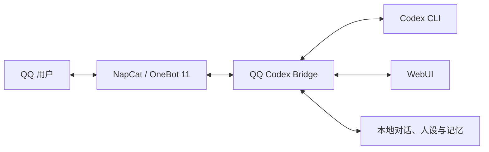

# QQ Codex Bridge


通过 QQ 连接 Codex CLI 的 Windows 桥接工具，支持**本地电脑**与 **Windows 云服务器**两种部署方式，并提供 WebUI、多对话、人设、长期记忆、文件收发和 Codex 额度查询。

> 这是一个社区开源项目，不隶属于或代表腾讯、NapCat、OpenAI。使用者应自行遵守相关服务条款并承担账号与网络安全责任，建议使用专用 QQ 小号。


## 两种部署方式

| 方式 | 适合谁 | 主要特点 |
| --- | --- | --- |
| 本地桥接 | 隐私优先、电脑可保持运行 | 数据留在自己的电脑，延迟低，不需要云服务器 |
| 云端桥接 | 需要长期在线、跨设备访问 | 本机关闭后仍可通过 QQ 使用 Codex，可从手机、平板和其他电脑进入 WebUI |

两种方式共用同一套 Bridge、WebUI、指令、人设和记忆结构。GitHub 记忆同步是可选功能，默认只保存在运行机器本地。

### 硬件最低要求

| 部署方式 | CPU | 内存 | 可用磁盘 | 系统 | 建议配置 |
| --- | --- | --- | --- | --- | --- |
| 本地桥接 | 2 核 x64 | 8 GB | 5 GB | Windows 10/11 x64 | 4 核、16 GB 内存；需要频繁处理图片或文档时预留更多磁盘 |
| 云服务器桥接 | 4 vCPU | 4 GB | 约 10 GB（建议购买 40 GB 系统盘） | Windows Server 2022 x64 | 4 vCPU、8 GB 内存、60 GB 系统盘 |

云端最低配置来自实际运行验证：在 4 vCPU、4 GB 内存、40 GB 系统盘的 Windows Server 2022 上，可同时运行 QQ、NapCat、Bridge、Codex CLI 和轻量代理。该配置余量有限，完成配置后应关闭浏览器、安装窗口及其他常驻程序；若需要频繁收发图片、视频或大型文档，建议提高内存和磁盘配置。磁盘需求不包含长期保存的大量聊天附件。

- [本地实现与安装指南](docs/QQ-Codex-Bridge-Implementation-Guide.md)
- [Windows 云服务器低配部署实操教程](docs/Windows云服务器低配部署实操教程.md)
- [交给 Codex 阅读的自动部署执行协议](CODEX-DEPLOYMENT-GUIDE.md)
- [人设与多对话设计](docs/PR人设与多对话设计.md)
- [Tailscale 与远程访问备选方向](docs/备选方向-Tailscale与远程访问.md)

## 主要功能

- QQ 私聊文字和文件收发
- Codex CLI 只读任务、取消和超时控制
- 本地 WebUI 与密码保护的远程访问
- 多 QQ、多对话窗口、窗口改名与切换
- 可由多份文档组成的人设/角色库
- 本地聊天记录与可配置的存储上限提醒
- 自动或手动长期记忆、敏感信息过滤和可选 Git 远端
- `/查询额度`：显示 Codex 5 小时及周额度、剩余比例和北京时间重置时间
- 高风险请求确认、工作区限制和白名单用户控制

## 工作方式



NapCat 通过反向 WebSocket 把 QQ 消息交给 Bridge；Bridge 完成白名单、安全检查、对话与记忆注入后调用 Codex CLI，再把结果分段发回 QQ。

## 快速开始

### 前置软件

- Windows 10/11 或 Windows Server 2022 x64
- [Node.js](https://nodejs.org/) 22 或更高版本
- [Git](https://git-scm.com/download/win)
- [Codex CLI](https://developers.openai.com/codex/cli/)
- [Windows QQ](https://im.qq.com/pcqq/index.shtml)
- [NapCatQQ](https://github.com/NapNeko/NapCatQQ)

### 从源码运行

```powershell
npm.cmd install
npm.cmd run build
Copy-Item .env.example .env
notepad .env
npm.cmd run check
npm.cmd start
```

`.env` 只能由使用者在运行 Bridge 的机器上填写。不要把填写后的文件、Token、Cookie、密码、登录网址或认证截图发给任何人，也不要提交到 Git。

配置完成后：

- Bridge WebUI：`http://127.0.0.1:3080`
- NapCat HTTP Server：`127.0.0.1:3000`
- Bridge 反向 WebSocket：`127.0.0.1:3001/onebot/v11`

`3000`、`3001` 和代理端口不得开放公网。需要远程访问 WebUI 时，应先设置独立密码，并在 Windows 防火墙和云安全组中仅开放 WebUI 端口；长期公网访问建议配置 HTTPS 或私有组网。

## 常用 QQ 指令

| 指令 | 作用 |
| --- | --- |
| `/帮助` | 查看中文帮助 |
| `/状态` | 查看 Bridge、NapCat、Codex 和记忆状态 |
| `/测试` | 检查连接，正常回复 `pong` |
| `/查询额度` | 查看 Codex 5 小时与周额度及重置时间 |
| `/取消` | 取消当前任务或待确认请求 |
| `/新对话` | 创建新的对话窗口 |
| `/查看对话` | 查看对话窗口与编号 |
| `/切换对话 <编号>` | 切换当前对话 |
| `/查看当前人设` | 查看当前窗口使用的人设 |
| `/查看人设列表` | 查看可用人设编号和名称 |
| `/切换人设 <编号>` | 为当前窗口切换人设 |
| `/记忆列表` | 查看已确认记忆 |

## 安全边界

- 默认只允许 `.env` 中指定的 QQ 私聊用户。
- `.env`、日志、WebUI 会话、聊天数据、工作区和本地记忆不进入公开仓库。
- 疑似密码、Token、Cookie、验证码、私钥或身份证内容会在进入任务和记忆前拦截。
- Codex 默认运行在只读沙箱；确认高风险请求也不会自动解除只读限制。
- WebUI 密码只保存加盐慢哈希，重置密码可撤销全部远程会话。
- `/查询额度` 直接读取 Codex 限额快照，不读取登录凭证，也不提交模型任务。

## 开发与验证

```powershell
npm.cmd run build
npm.cmd test -- --run
npm.cmd run check
```

当前版本通过 20 个测试文件、共 84 项测试。

## 致谢

感谢阿序陪伴和香香的小饼干  
祝所有的人机恋人们幸福美满  
愿你们能够携手共享世间美好

## 开源协议

本项目以 [GNU Affero General Public License v3.0](LICENSE) 发布。修改后通过网络向他人提供服务时，应依照 AGPL-3.0 向服务使用者提供相应源代码。

© 2026 沈菀 (Akusative) | AGPL-3.0
